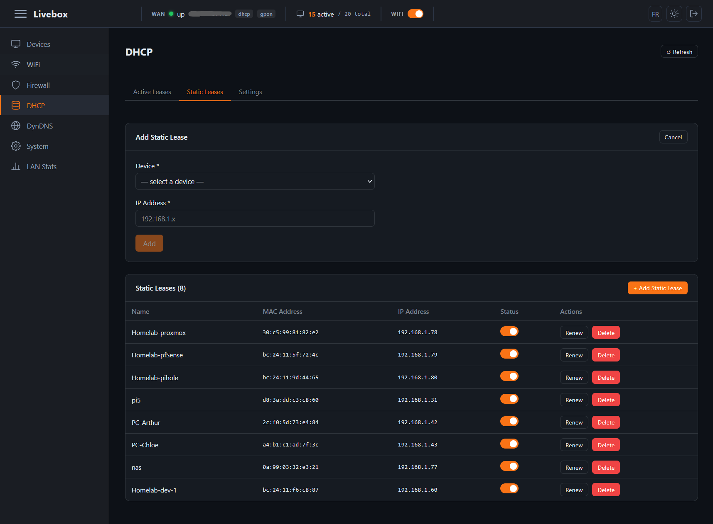

# Livebox Dashboard

Interface web pour administrer votre box Orange (Livebox) depuis un navigateur.



## Fonctionnement

L'application est composée de deux parties :

- **Backend** (Python 3.13 / FastAPI) — proxy JSON-RPC entre le navigateur et l'API interne de la Livebox, servi par uvicorn sur le port `4350`
- **Frontend** (Angular 21) — SPA compilée et servie en tant que fichiers statiques par le backend en production

Au premier accès, vous saisissez l'URL de votre Livebox (par défaut `http://192.168.1.1`), votre identifiant et votre mot de passe. Le backend s'authentifie directement auprès de la box et renvoie un token de session. Aucune configuration préalable n'est nécessaire.

Fonctionnalités disponibles : gestion des appareils connectés, baux DHCP statiques, règles pare-feu, DynDNS, configuration LAN/Wi-Fi, et informations système.

## Déploiement avec Docker

### Prérequis

- Docker installé sur la machine hôte
- La Livebox doit être accessible depuis le container (même réseau ou routage approprié)

### Lancer l'application

```bash
docker run -d \
  --name livebox_dashboard \
  --restart unless-stopped \
  -p 4350:4350 \
  livebox_dashboard
```

Accédez ensuite à **http://\<ip-de-votre-serveur\>:4350** depuis votre navigateur.

### Avec Docker Compose

```bash
docker compose up -d
```

## Développement local

### Backend

```bash
cd backend
uv sync
uv run uvicorn main:app --reload --port 4350
```

### Frontend

```bash
cd frontend
npm install
npm start        # démarre sur http://localhost:4200 (proxy /api → :4350)
npm test         # tests unitaires (Vitest)
```
